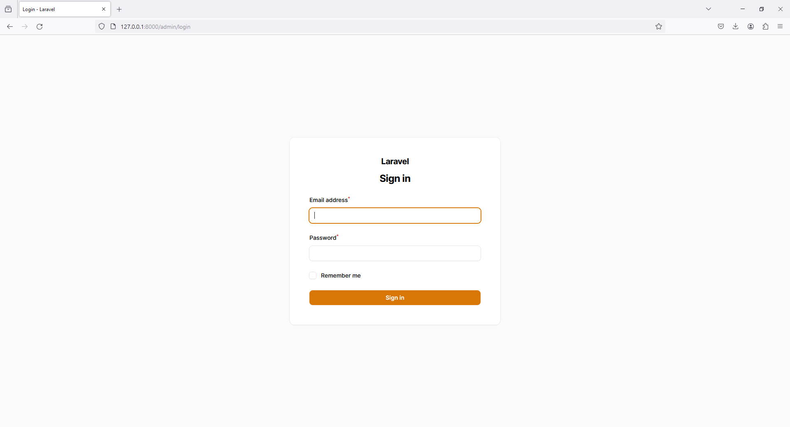
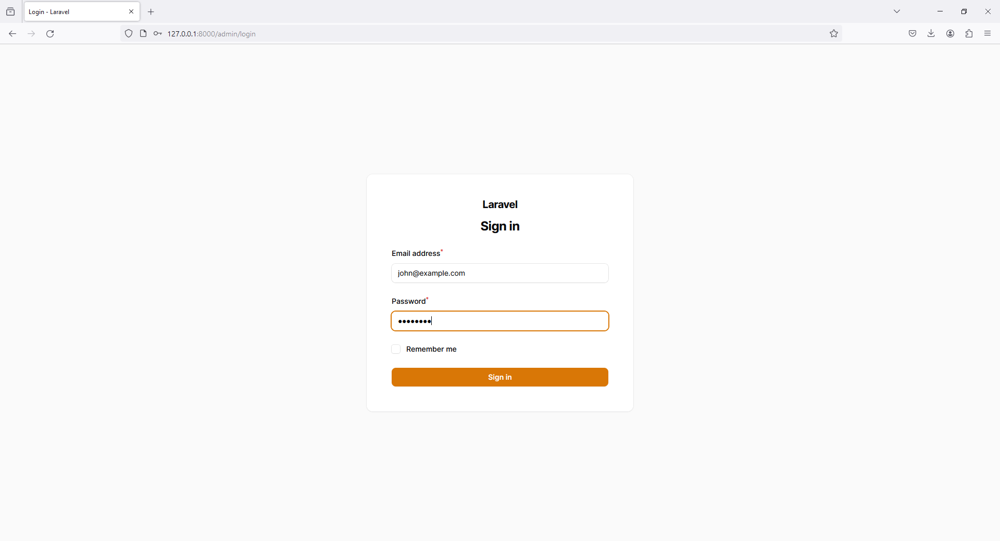
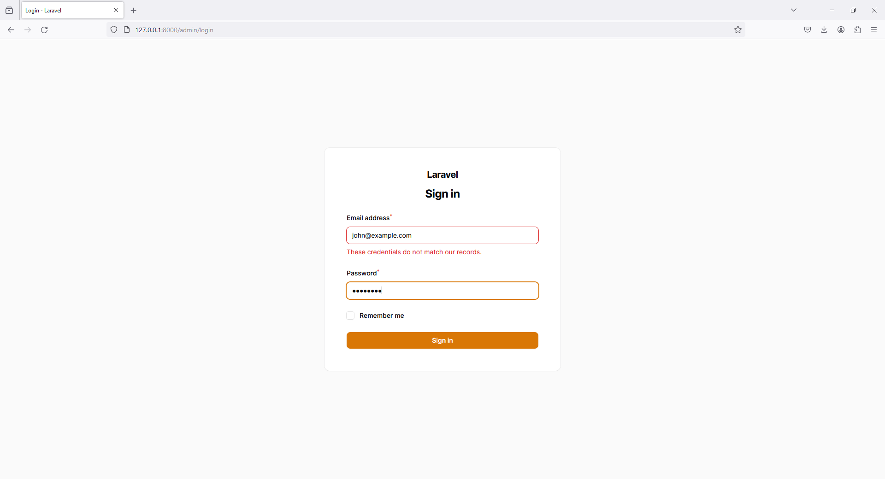
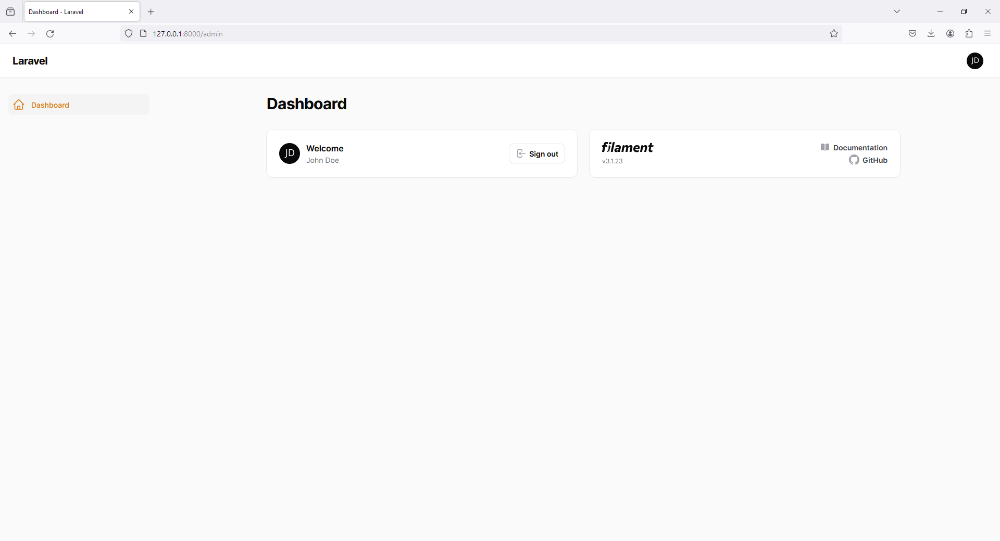
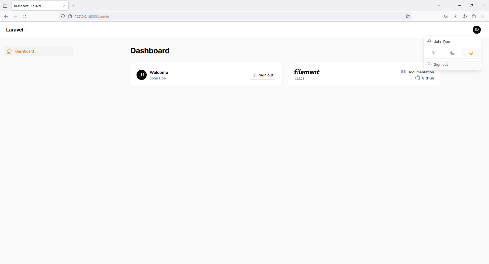
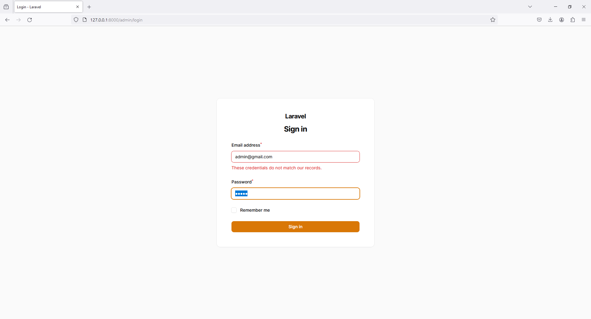

# 5 - Filament Seed User

This project demonstrates how to set up and run a user seeder in a Laravel application, including creating the necessary seeder class, controller, and route.

## Table of Contents

1. [Authorizing Access to the Panel](#1-authorizing-access-to-the-panel)
2. [Development to Production](#2-development-to-production)
3. [Command Setup](#3-command-setup)
   - [Creating the Seeder](#creating-the-seeder)
   - [UsersTableSeeder Class](#userstableSeeder-class)
   - [DatabaseSeeder Class](#databaseseeder-class)
   - [Creating the Seeder Controller](#creating-the-seeder-controller)
   - [SeederController Class](#seedercontroller-class)
   - [Defining the Route](#defining-the-route)
4. [Running the Server](#4-running-the-server)
5. [Running Seeder From Controller](#5-running-seeder-from-controller)
 
## 1. Authorizing Access to the Panel

For details on authorizing access to the Filament panel, refer to the [Filament Documentation on Authorizing Access](https://filamentphp.com/docs/3.x/panels/users).

## 2 - Development to Production

### .env Configuration

Change the environment configuration from local to production in your `.env` file:

```
APP_ENV=local 
```

change to
```
APP_ENV=production 
```

## 3 - Command Setup

*Create the seeder using the Artisan command:*
```
php artisan make:seeder UsersTableSeeder
```

```php
<?php

namespace Database\Seeders;

use Illuminate\Database\Seeder;

use Illuminate\Support\Facades\DB;
use Illuminate\Support\Facades\Hash;

use App\Models\User;

class UsersTableSeeder extends Seeder
{
    /**
     * Run the database seeds.
     *
     * @return void
     */
    public function run()
    {
        // Insert a sample user into the users table
        DB::table('users')->insert([
            'name' => 'John Doe',
            'email' => 'john@example.com',
            'password' => Hash::make('password'),
        ]);

        User::factory()->create([
            'name' => 'admin',
            'email' => 'admin@gmail.com',
            'password' => Hash::make('password'),
        ]);
    }
}

```

```php
<?php

namespace Database\Seeders;

use Illuminate\Database\Seeder;

class DatabaseSeeder extends Seeder
{
    /**
     * Seed the application's database.
     *
     * @return void
     */
    public function run()
    {
        // Call the UsersTableSeeder class
        $this->call(UsersTableSeeder::class);
    }
}
```

*Create a new controller*
```
php artisan make:controller SeederController
```

```php
<?php

namespace App\Http\Controllers;

use Illuminate\Http\Request;
use Illuminate\Support\Facades\Artisan;

class SeederController extends Controller
{
    public function runUserSeeder()
    {
        try {
            // Run the UsersTableSeeder
            Artisan::call('db:seed', ['--class' => 'UsersTableSeeder']);

            // Optionally, you can get the output of the seed command
            $output = Artisan::output();

            return response()->json(['message' => 'Seeder successfully executed', 'output' => $output]);
        } catch (\Exception $e) {
            return response()->json(['error' => 'Error running seeder', 'message' => $e->getMessage()], 500);
        }
    }
}
```

### web.php
```php
<?php

use App\Http\Controllers\SeederController;

Route::get('/run-user-seeder', [SeederController::class, 'runUserSeeder']);
```
## Run Server

```
php artisan serve
```

## Run Seeder From Controller
```
http://your-app-url/run-user-seeder
```






