# 6 - Laravel Filament Roles and Permissions

1. **Create New Project**

    ```
    composer create-project laravel/laravel filament-roles
    ```

1. **Navigate to Project Folder**
    ```
    cd filament-roles
    ``` 

1. **Run Migrate**
    ```
    php artisan migrate
    ```

1. **Filament Installation**
    ```
    composer require filament/filament:"^3.1" -W
    ```

1. **Filament Panel Installation**
    ``` 
    php artisan filament:install --panels
    ```

1. **Create Super User**
    ```
    php artisan make:filament-user

    Name:
    ❯ admin

    Email address:
    ❯ admin@gmail.com

    Password:
    ❯ admin

    INFO  Success! admin@gmail.com may now log in at http://127.0.0.1:8000/admin/login.
    ```

1. **Run Server**
    ```
    php artisan serve
    ```

1. **Install Laravel Permission Library**

    [spatie](https://spatie.be/docs/laravel-permission/v6/introduction)

    Associate users with roles and permissions

    You can install the package via composer:

    ```
    composer require spatie/laravel-permission
    ```

    2) Optional: The service provider will automatically get registered. Or you may manually add the service provider in your config/app.php file:

    ```php
    'providers' => [
        // ...
        Spatie\Permission\PermissionServiceProvider::class,
    ];
    ```


    3) You should publish the migration and the config/permission.php config file with:

    ```php
    php artisan vendor:publish --provider="Spatie\Permission\PermissionServiceProvider"
    ```

    4) Clear your config cache. This package requires access to the permission config settings in order to run migrations. If you've been caching configurations locally, clear your config cache with either of these commands:

    ```php
    php artisan optimize:clear
    ```

    #### OR

    ```php
    php artisan config:clear
    ```


    5) Run the migrations: After the config and migration have been published and configured, you can create the tables for this package by running:

    ```php
    php artisan migrate
    ```


1. **Create Fliment Resource Role**
    ```
    php artisan make:filament-resource Role
    ```

    ```php
    <?php

    namespace App\Filament\Resources;

    use App\Filament\Resources\RoleResource\Pages;
    use App\Filament\Resources\RoleResource\RelationManagers;

    use Filament\Forms;
    use Filament\Forms\Form;
    use Filament\Resources\Resource;
    use Filament\Tables;
    use Filament\Tables\Table;
    use Illuminate\Database\Eloquent\Builder;
    use Illuminate\Database\Eloquent\SoftDeletingScope;

    // Import Model
    use Spatie\Permission\Models\Role;

    // Table Columns
    use Filament\Tables\Columns\TextColumn;

    // FORMS
    use Filament\Forms\Components\TextInput;
    use Filament\Forms\Components\Section;

    class RoleResource extends Resource
    {
        protected static ?string $model = Role::class;

        protected static ?string $navigationIcon = 'heroicon-o-finger-print';

        protected static ?int $navigationSort = 2;

        protected static ?string $navigationGroup = 'Settings';

        public static function form(Form $form): Form
        {
            return $form
                ->schema([

                    Section::make('User Roles')
                    ->description('Role Must be Minimum 2 Maximum 255 Character')
                    ->schema([            
                        TextInput::make('name')
                            ->minLength(2)
                            ->maxLength(255)
                            ->required()
                            ->unique()
                    ])

                ]);
        }

        public static function table(Table $table): Table
        {
            return $table
                ->columns([
                    TextColumn::make('name')
                ])
                ->filters([
                    //
                ])
                ->actions([
                    Tables\Actions\EditAction::make(),
                ])
                ->bulkActions([
                    Tables\Actions\BulkActionGroup::make([
                        Tables\Actions\DeleteBulkAction::make(),
                    ]),
                ]);
        }

        public static function getRelations(): array
        {
            return [
                //
            ];
        }

        public static function getPages(): array
        {
            return [
                'index' => Pages\ListRoles::route('/'),
                'create' => Pages\CreateRole::route('/create'),
                'edit' => Pages\EditRole::route('/{record}/edit'),
            ];
        }
    }
    ```

1. **Create Fliment Resource Permission**
    ```
    php artisan make:filament-resource Permission
    ```

    ```php
    <?php

    namespace App\Filament\Resources;

    use App\Filament\Resources\PermissionResource\Pages;
    use App\Filament\Resources\PermissionResource\RelationManagers;
    use Filament\Forms;
    use Filament\Forms\Form;
    use Filament\Resources\Resource;
    use Filament\Tables;
    use Filament\Tables\Table;
    use Illuminate\Database\Eloquent\Builder;
    use Illuminate\Database\Eloquent\SoftDeletingScope;

    // Import Model
    use Spatie\Permission\Models\Permission;

    // Table Columns
    use Filament\Tables\Columns\TextColumn;

    // FORMS
    use Filament\Forms\Components\TextInput;
    use Filament\Forms\Components\Section;

    class PermissionResource extends Resource
    {
        protected static ?string $model = Permission::class;

        protected static ?string $navigationIcon = 'heroicon-o-key';

        protected static ?int $navigationSort = 3;

        protected static ?string $navigationGroup = 'Settings';

        public static function form(Form $form): Form
        {
            return $form
                ->schema([
                    Section::make('Roles Permission')
                    ->description('Permission Must be Minimum 2 Maximum 255 Character')
                    ->schema([            
                        TextInput::make('name')
                            ->minLength(2)
                            ->maxLength(255)
                            ->required()
                            ->unique()
                    ])
                ]);
        }

        public static function table(Table $table): Table
        {
            return $table
                ->columns([
                    TextColumn::make('name')
                ])
                ->filters([
                    //
                ])
                ->actions([
                    Tables\Actions\EditAction::make(),
                ])
                ->bulkActions([
                    Tables\Actions\BulkActionGroup::make([
                        Tables\Actions\DeleteBulkAction::make(),
                    ]),
                ]);
        }

        public static function getRelations(): array
        {
            return [
                //
            ];
        }

        public static function getPages(): array
        {
            return [
                'index' => Pages\ListPermissions::route('/'),
                'create' => Pages\CreatePermission::route('/create'),
                'edit' => Pages\EditPermission::route('/{record}/edit'),
            ];
        }
    }
    ```

1. **Create Fliment Resource User**
    ```
    php artisan make:filament-resource User --generate
    ```

    ```php
    <?php

    namespace App\Filament\Resources;

    use App\Filament\Resources\UserResource\Pages;
    use App\Filament\Resources\UserResource\RelationManagers;
    use App\Models\User;
    use Filament\Forms;
    use Filament\Forms\Form;
    use Filament\Resources\Resource;
    use Filament\Tables;
    use Filament\Tables\Table;
    use Illuminate\Database\Eloquent\Builder;
    use Illuminate\Database\Eloquent\SoftDeletingScope;

    use Filament\Forms\Components\Section;
    use Filament\Forms\Components\TextInput;
    use Filament\Forms\Components\DateTimePicker;
    use Filament\Forms\Components\Select;


    use Illuminate\Validation\Rules\Password;
    use Illuminate\Support\Facades\Hash;


    use App\Filament\Resources\UserResource\Pages\CreateRecord;

    class UserResource extends Resource
    {
        protected static ?string $model = User::class;

        protected static ?string $navigationIcon = 'heroicon-o-user-group';

        protected static ?string $navigationGroup = 'Settings';
    
        protected static ?int $navigationSort = 3;

        public static function form(Form $form): Form
        {
            return $form
                ->schema([
                    Section::make('User Details')
                    ->schema([
                        TextInput::make('name')
                            ->required()
                            ->maxLength(255),
                        TextInput::make('email')
                            ->email()
                            ->required()
                            ->unique(ignoreRecord: true),
                        // DateTimePicker::make('email_verified_at'),
                        
                            
                    ]),
                    Section::make('User New Password')->schema([
                        TextInput::make('password')
                            ->nullable()
                            ->password()
                            ->revealable()                        
                            ->dehydrateStateUsing(fn ($state) => Hash::make($state))
                            ->dehydrated(fn ($state) => filled($state))
                            ->required(fn ($livewire) => ($livewire instanceof CreateRecord))                    
                            ->rule(Password::default()),
                    ]),
                    Section::make('Role Management')->schema([
                        Select::make('roles')
                            ->multiple()
                            ->preload()
                            ->relationship('roles', 'name')
                    ])
                ]);
        }

        public static function table(Table $table): Table
        {
            return $table
                ->columns([
                    Tables\Columns\TextColumn::make('name')
                        ->searchable(),
                    Tables\Columns\TextColumn::make('email')
                        ->searchable(),
                    Tables\Columns\TextColumn::make('email_verified_at')
                        ->dateTime()
                        ->sortable(),
                    Tables\Columns\TextColumn::make('created_at')
                        ->dateTime()
                        ->sortable()
                        ->toggleable(isToggledHiddenByDefault: true),
                    Tables\Columns\TextColumn::make('updated_at')
                        ->dateTime()
                        ->sortable()
                        ->toggleable(isToggledHiddenByDefault: true),
                ])
                ->filters([
                    //
                ])
                ->actions([
                    Tables\Actions\ViewAction::make(),
                    Tables\Actions\EditAction::make(),
                ])
                ->bulkActions([
                    Tables\Actions\BulkActionGroup::make([
                        Tables\Actions\DeleteBulkAction::make(),
                    ]),
                ]);
        }

        public static function getRelations(): array
        {
            return [
                //
            ];
        }

        public static function getPages(): array
        {
            return [
                'index' => Pages\ListUsers::route('/'),
                'create' => Pages\CreateUser::route('/create'),
                'edit' => Pages\EditUser::route('/{record}/edit'),
            ];
        }

        public static function getNavigationBadge(): ?string
        {
            return static::getModel()::count();
        }
    }
    ```

    ```php
    <?php

    namespace App\Filament\Resources\UserResource\Pages;

    use App\Filament\Resources\UserResource;
    use Filament\Actions;
    use Filament\Resources\Pages\CreateRecord;

    class CreateUser extends CreateRecord
    {
        protected static string $resource = UserResource::class;
    }

    ```
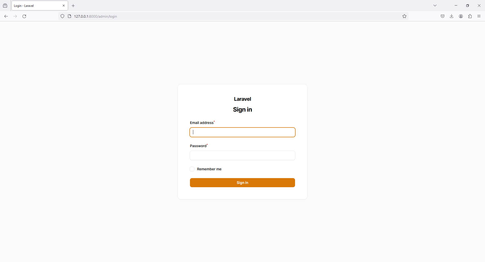
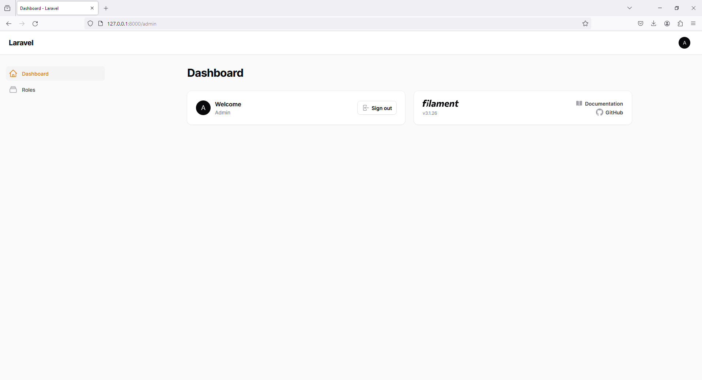
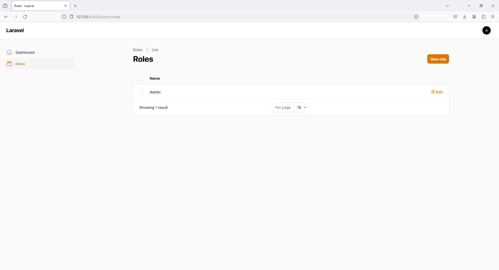
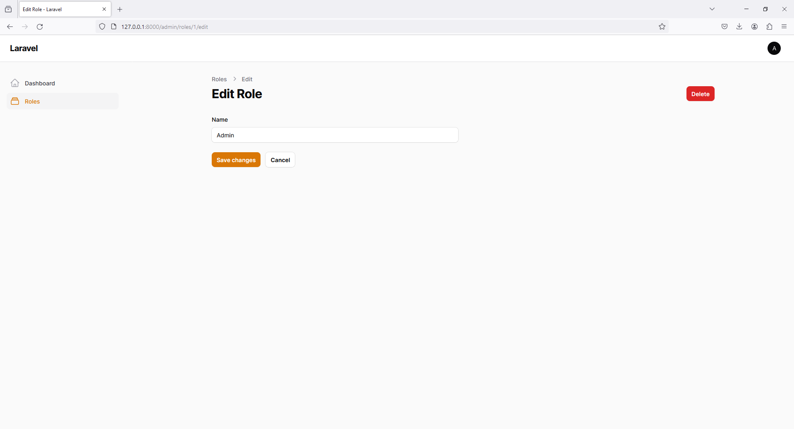
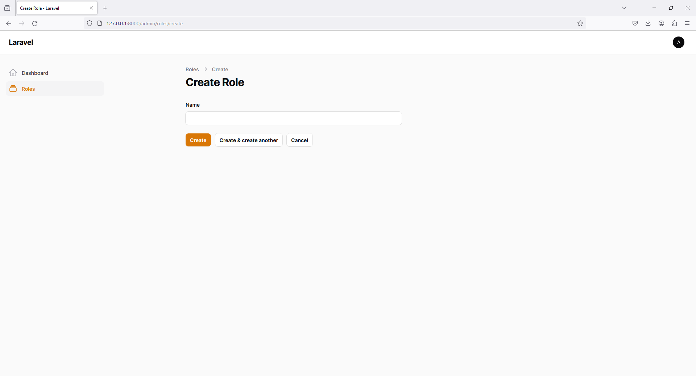
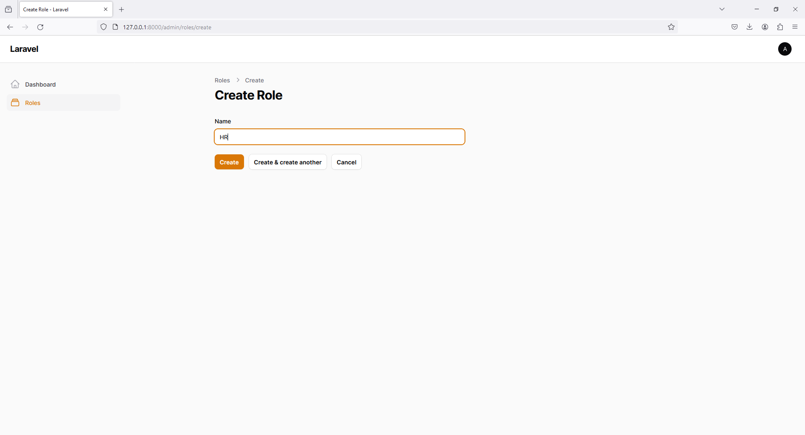
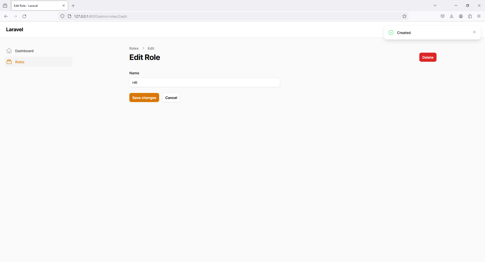
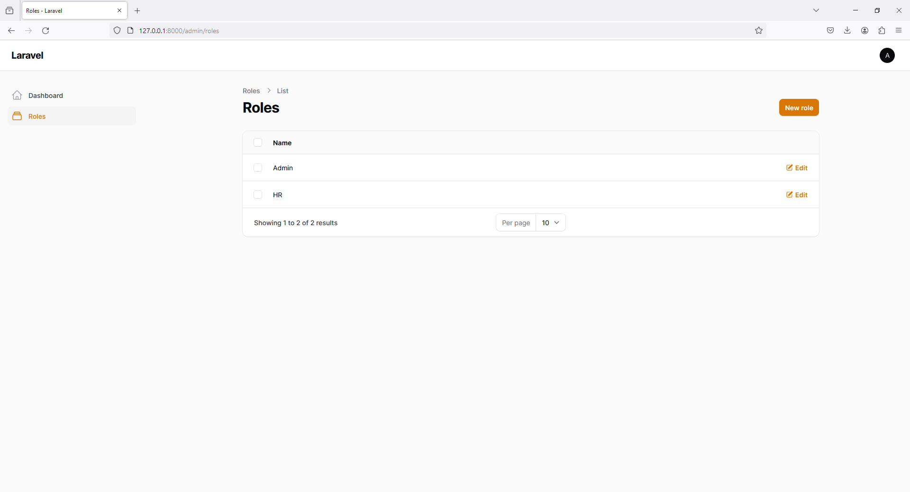

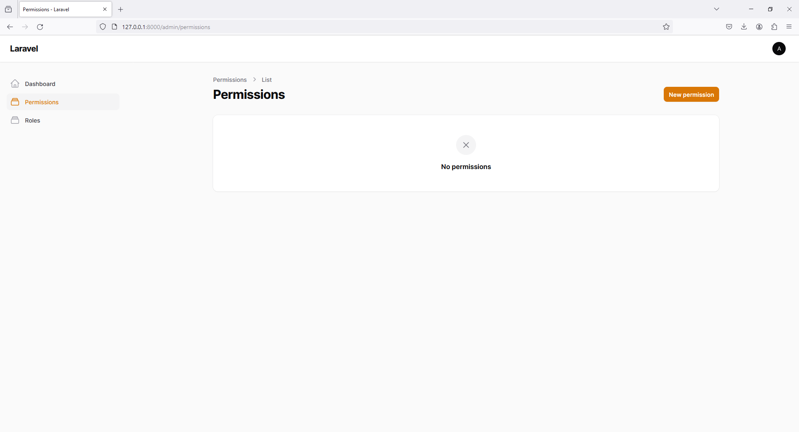
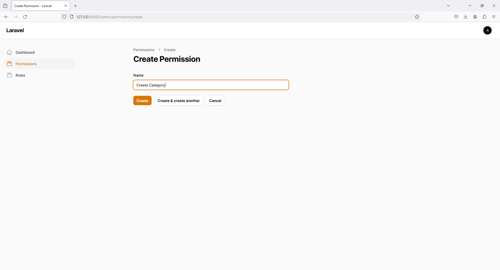
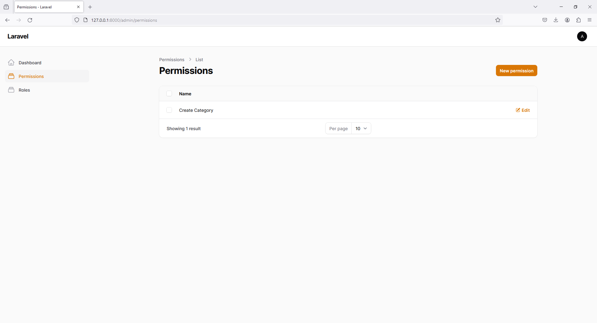